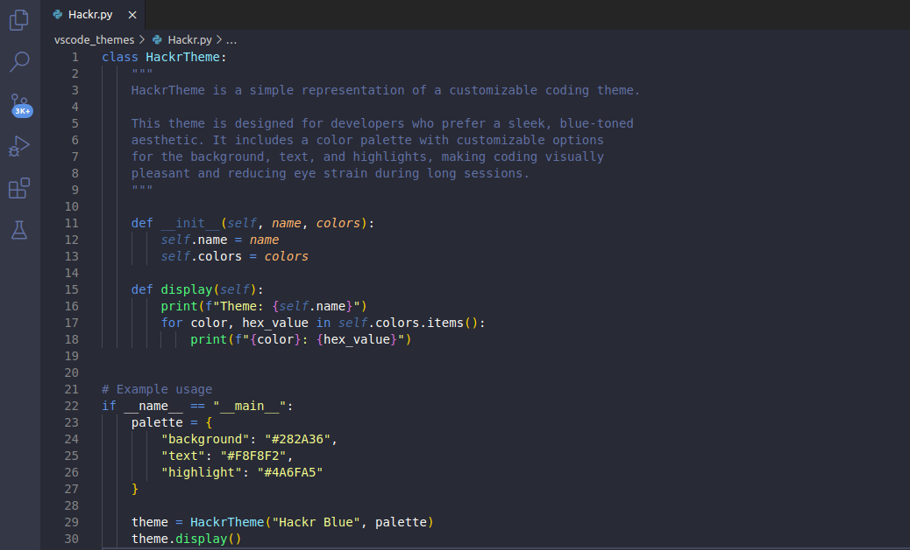

# hackr-theme README

Hackr.io Theme is a custom Visual Studio Code theme featuring a sleek, blue-based color scheme designed to enhance your coding experience. The theme focuses on using calming blue tones, reducing eye strain, and providing a modern, professional look for developers.

🖌 Features

- Blue Highlights: Carefully selected shades of blue to create a visually pleasing environment.
- Dark Theme: Ideal for long coding sessions, especially in low-light settings.
- Improved Readability: A balanced color palette that prioritizes readability and reduces distractions.
- Multi-Language Support: Optimized syntax highlighting for a wide range of programming languages, including JavaScript, Python, HTML, CSS, and more.

🎨 Color Palette

- Dark Blue for keywords and headers.
- Light Blue for active elements and selections.
- Bright Green for success and additions.
- Bright Red for errors and deletions.
- Soft Yellow for warnings.

🚀 Installation

- Open Visual Studio Code.
- Go to the Extensions view by clicking on the Extensions icon in the Activity Bar on the side of the window.
- Search for Hackr Theme.
- Click Install to install the theme.
- Open the Command Palette (Ctrl+Shift+P or Cmd+Shift+P on macOS) and type Color Theme.
- Choose Hackr Theme from the list.

🔧 Customization

You can easily tweak the theme by customizing the following settings in your settings.json:

## 💻 Screenshots

Here's a preview of the **Hackr.io Theme** in action:

📦 Contributing

Feel free to contribute! If you find a bug or have a feature request, please open an issue or submit a pull request on GitHub.
📝 License

This theme is released under the [MIT License]
